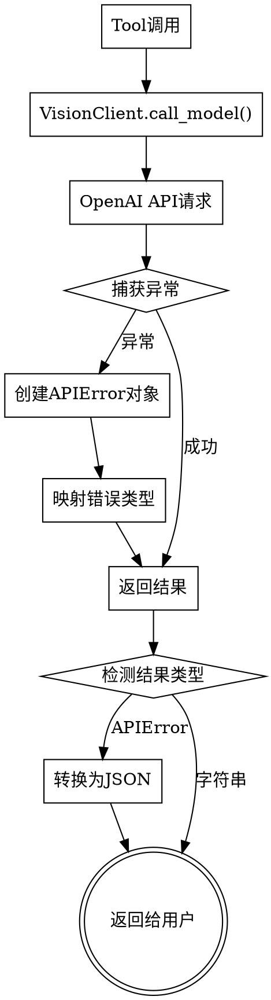

# Vision MCP 增强错误提示设计

## 概述

为Vision MCP工具增强错误提示，使其返回包含HTTP状态码、错误消息、错误类型和建议的结构化JSON格式错误信息。

## 目标

- 提供详细的API错误信息（HTTP状态码、原始错误消息）
- 自动分类错误类型
- 给出针对性的解决建议
- 统一错误返回格式为JSON

## 错误类型分类

根据OpenAI API常见错误建立以下分类：

| 错误类型 | HTTP状态码 | 说明 | 建议信息 |
|---------|-----------|------|---------|
| `not_found` | 404 | API端点或模型不存在 | 请检查config.yaml中的base_url和model_name配置，确认API端点正确 |
| `auth_error` | 401, 403 | 认证失败或权限不足 | 请检查config.yaml中的api_key是否正确 |
| `rate_limit` | 429 | 请求频率超限 | 请求频率超限，请稍后重试 |
| `network_error` | None | 网络连接问题 | 网络连接失败，请检查网络或base_url配置 |
| `invalid_request` | 400 | 请求参数错误 | 请求参数无效，请检查图片格式或请求内容 |
| `server_error` | 500, 502, 503 | 服务器端错误 | API服务器错误，请稍后重试 |
| `local_error` | None | 本地错误（文件不存在等） | 请检查输入参数是否正确 |
| `unknown` | 其他 | 未分类错误 | 未知错误，请查看错误消息详情 |

## 架构设计

### 整体流程



### 组件职责

**1. VisionClient (src/vision_client.py)**
- 捕获OpenAI API异常
- 提取错误信息（状态码、消息）
- 根据状态码映射错误类型和建议
- 返回APIError对象或正常结果

**2. APIError数据类**
- 存储结构化错误信息
- 包含字段：status_code, error_message, error_type, suggestion

**3. Tool函数 (src/main.py)**
- 检测VisionClient返回类型
- 将APIError转换为JSON格式
- 处理本地异常（文件不存在等）

## 实现细节

### APIError数据类

```python
from dataclasses import dataclass
from typing import Optional

@dataclass
class APIError:
    status_code: Optional[int]
    error_message: str
    error_type: str
    suggestion: str
```

### 错误映射函数

```python
def _get_error_info(status_code: Optional[int], message: str) -> dict:
    """根据HTTP状态码映射错误类型和建议"""
    error_mapping = {
        400: {
            "error_type": "invalid_request",
            "suggestion": "请求参数无效，请检查图片格式或请求内容"
        },
        401: {
            "error_type": "auth_error",
            "suggestion": "请检查config.yaml中的api_key是否正确"
        },
        403: {
            "error_type": "auth_error",
            "suggestion": "权限不足，请检查api_key权限或model_name配置"
        },
        404: {
            "error_type": "not_found",
            "suggestion": "请检查config.yaml中的base_url和model_name配置，确认API端点正确"
        },
        429: {
            "error_type": "rate_limit",
            "suggestion": "请求频率超限，请稍后重试"
        },
        500: {
            "error_type": "server_error",
            "suggestion": "API服务器错误，请稍后重试"
        },
        502: {
            "error_type": "server_error",
            "suggestion": "API网关错误，请稍后重试"
        },
        503: {
            "error_type": "server_error",
            "suggestion": "API服务不可用，请稍后重试"
        }
    }
    
    if status_code and status_code in error_mapping:
        info = error_mapping[status_code]
    else:
        info = {
            "error_type": "unknown",
            "suggestion": "未知错误，请查看错误消息详情"
        }
    
    info["status_code"] = status_code
    info["error_message"] = message
    return info
```

### VisionClient改进

```python
from openai import OpenAI, APIStatusError, APIError

class VisionClient:
    def call_model(self, messages: list[dict]) -> str | APIError:
        try:
            response = self._client.chat.completions.create(
                model=self._config.model_name,
                messages=messages,
                max_tokens=self._config.max_tokens,
            )
            if not response.choices:
                return APIError(
                    status_code=None,
                    error_message="Model returned empty response",
                    error_type="server_error",
                    suggestion="API返回空响应，请稍后重试"
                )
            content = response.choices[0].message.content
            if content is None:
                return APIError(
                    status_code=None,
                    error_message="Model returned null content",
                    error_type="server_error",
                    suggestion="API返回空内容，请稍后重试"
                )
            return content
        except APIStatusError as e:
            # 有HTTP状态码的错误
            error_info = _get_error_info(e.status_code, str(e))
            return APIError(**error_info)
        except APIError as e:
            # 其他API错误（无状态码）
            return APIError(
                status_code=None,
                error_message=str(e),
                error_type="api_error",
                suggestion="API调用失败，请检查配置或稍后重试"
            )
        except Exception as e:
            # 网络错误等
            error_message = str(e).lower()
            if "connection" in error_message or "timeout" in error_message:
                return APIError(
                    status_code=None,
                    error_message=str(e),
                    error_type="network_error",
                    suggestion="网络连接失败，请检查网络或base_url配置"
                )
            # 其他未知错误
            return APIError(
                status_code=None,
                error_message=str(e),
                error_type="unknown",
                suggestion="未知错误，请查看错误消息详情"
            )
```

### main.py改进

```python
import json

def describe_image(...):
    try:
        # ... 图片加载逻辑
        
        result = vision.call_model(messages)
        
        # 检查是否为错误对象
        if isinstance(result, APIError):
            return json.dumps({
                "status_code": result.status_code,
                "error_message": result.error_message,
                "error_type": result.error_type,
                "suggestion": result.suggestion
            }, ensure_ascii=False, indent=2)
        
        return result
    except Exception as e:
        # 处理本地错误（文件不存在、图片格式错误等）
        return json.dumps({
            "status_code": None,
            "error_message": str(e),
            "error_type": "local_error",
            "suggestion": "请检查输入参数是否正确"
        }, ensure_ascii=False, indent=2)
```

## 错误返回示例

### API错误示例

```json
{
  "status_code": 404,
  "error_message": "Error code: 404 - {'error': {'message': 'The model gpt-4o does not exist', 'type': 'invalid_request_error', 'param': None, 'code': 'model_not_found'}}",
  "error_type": "not_found",
  "suggestion": "请检查config.yaml中的base_url和model_name配置，确认API端点正确"
}
```

### 本地错误示例

```json
{
  "status_code": null,
  "error_message": "Image file not found: /path/to/image.png",
  "error_type": "local_error",
  "suggestion": "请检查输入参数是否正确"
}
```

## 测试计划

### 单元测试

1. **test_vision_client.py**
   - 测试APIStatusError异常处理（各种HTTP状态码）
   - 测试APIError异常处理
   - 测试网络错误处理
   - 测试正常响应返回

2. **test_main.py**
   - 测试APIError对象转换为JSON
   - 测试本地异常转换为JSON
   - 测试正常结果返回

### 集成测试

1. 使用无效的base_url测试404错误
2. 使用无效的api_key测试401错误
3. 使用不存在的model_name测试404错误
4. 使用不存在的文件路径测试本地错误

## 改动文件清单

- `src/vision_client.py` - 添加APIError数据类，改进call_model方法
- `src/main.py` - 修改三个tool函数的错误处理逻辑
- `tests/test_vision_client.py` - 添加错误处理测试
- `tests/test_main.py` - 添加JSON错误返回测试

## 兼容性

- 保持现有的成功返回格式不变
- 错误返回从简单文本改为JSON格式
- 用户可以通过JSON解析来判断是否出错

## 后续改进

- 可以考虑添加错误码（error_code）字段，便于程序化处理
- 可以添加错误文档链接，帮助用户查找解决方案
- 可以考虑支持多语言错误提示